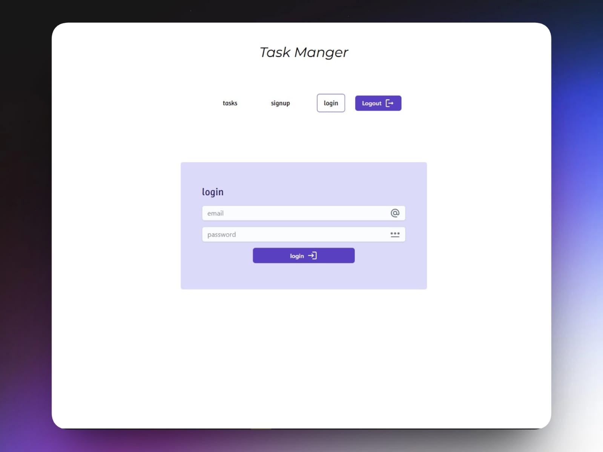

# Task Manager Frontend

A modern and responsive frontend for a task management application, built with React.js. This application provides a user-friendly interface for managing tasks, integrated with a backend API to handle task CRUD operations and user authentication.

<a href="https://task-manager-79.netlify.app/login" target="_blank">
<p align="center">

</p>
</a>


## Features
- **Task Management**: Create, view, update, and delete tasks with details like title, description, status, and due date.
- **User Authentication**: Secure login and registration forms with JWT-based authentication.
- **Responsive Design**: Fully responsive UI that works on desktop, tablet, and mobile devices.
- **State Management**: Efficient state management using React Context API or Redux for seamless data flow.
- **API Integration**: Fetch and display tasks from the backend API, with error handling for failed requests.
- **Interactive UI**: Smooth user experience with modals, forms, and task filtering (e.g., by status).

## Tech Stack
- **React.js**: JavaScript library for building the user interface.
- **React Router**: For client-side routing and navigation.
- **Axios**: For making HTTP requests to the backend API.
- **CSS**: For styling and responsive design.
- **React Context API** or **Redux**: For state management.
- **Vite**: Build tool for fast development and production builds.
- **ESLint & Prettier**: For code linting and formatting.

## Prerequisites
Before setting up the project, ensure you have the following installed:
- Node.js (v16 or higher)
- npm (v8 or higher)
- Git
- A running instance of the [Task Manager Backend](https://github.com/Nemo97-76/task-manager-backend)

## Installation
Follow these steps to set up and run the project locally:

1. **Clone the Repository**:
   ```bash
   git clone https://github.com/Nemo97-76/task-manger-frontend.git
   cd task-manger-frontend
   ```

2. **Install Dependencies**:
   ```bash
   npm install
   ```

3. **Set Up Environment Variables**:
   - Create a `.env` file in the root directory.
   - Add the following variable (replace with your backend API URL):
     ```
     VITE_API_URL=http://localhost:5000/api
     ```

4. **Start the Development Server**:
   ```bash
   npm run dev
   ```
   - The app will run on `http://localhost:5173` (or the port specified by Vite).

5. **Build for Production**:
   ```bash
   npm run build
   ```
## Usage
- **Access the App**: Open `http://localhost:5173` in your browser.
- **Register/Login**: Create an account or log in to access task management features.
- **Manage Tasks**: Use the interface to add, edit, delete, or filter tasks.
- Ensure the backend server is running (see [Task Manager Backend](https://github.com/Nemo97-76/task-manager-backend)) for full functionality.

## Project Structure
```plaintext
/task-manger-frontend
├── /public
├── /src
│   ├── /components
│   │   ├── Tasks.jsx
│   │   ├── Login.jsx
│   │   ├── Signup.jsx
│   ├── App.css
│   ├── App.jsx
│   ├── main.jsx
├── .gitignore
├── eslint.config.js
├── package.json
├── package-lock.json
├── README.md
├── index.html
```

## API Integration
This frontend connects to the [Task Manager Backend](https://github.com/Nemo97-76/task-manager-backend) for data operations. Key endpoints include:
- **POST /api/auth/register**: Register a new user.
- **POST /api/auth/login**: Log in a user and receive a JWT token.
- **GET /api/tasks**: Fetch all tasks for the authenticated user.
- **POST /api/tasks**: Create a new task.
- **PUT /api/tasks/:id**: Update a task.
- **DELETE /api/tasks/:id**: Delete a task.

## Demo
for live preview <a href="https://task-manager-79.netlify.app/login" target="_blank">Demo</a>

## Contact
- **Email**: tasneemyoussef61@gmail.com
